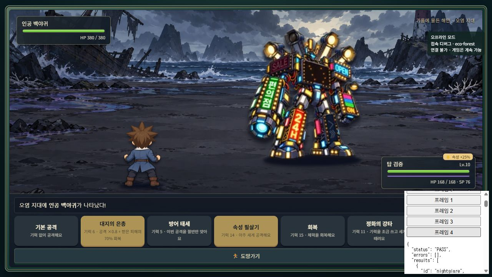
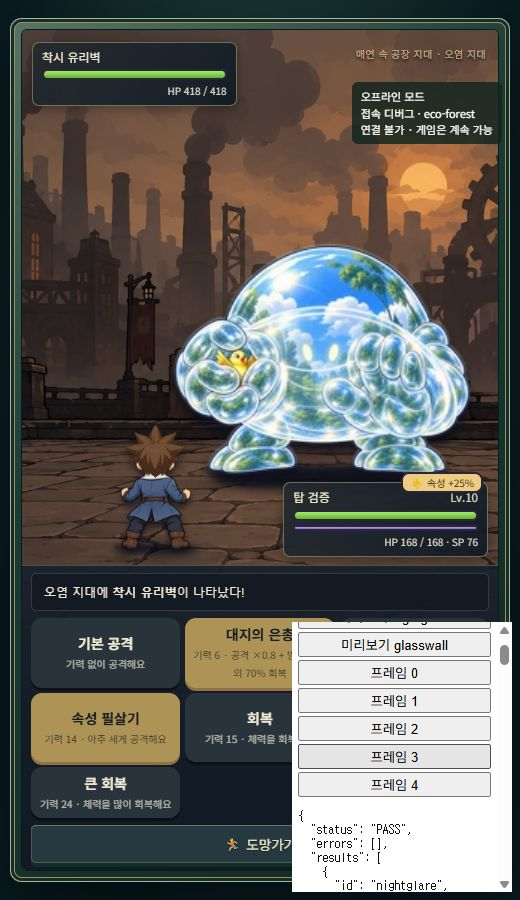

# 인공 백야귀 / 착시 유리벽

## 적용 범위

두 몬스터를 기존 탑 상위 중간보스 데이터에 추가했다. 기존 6종의 층, HP, ATK, 경험치, 골드는 유지한다. 저장 형식/키, 지역 몬스터, 플레이어 스탯, 장비, 미니게임, 멀티플레이 코드는 변경하지 않았다.

| 몬스터 | 후속 전투 층 | HP | ATK | 기본 피해 감소 | 경험치 | 골드 |
|---|---:|---:|---:|---:|---:|---:|
| 인공 백야귀 | 20 | 380 | 52 | 11% | 66 | 84 |
| 착시 유리벽 | 24 | 418 | 50 | 13% | 78 | 100 |

해당 층의 원래 전투 승리 후 기존 상위 중간보스 안내/대결 흐름으로 등장한다. 승리 후 다음 층 진행, 패배/재도전과 중복 보상 방지를 재사용한다.

## 행동 수치

- 인공 백야귀: 눈부신 섬광은 기본 피해와 눈부심 2턴(플레이어 공격 피해 ×0.85). 밤낮 뒤섞기는 직접 피해 없이 이후 2회 SP 회복을 2→1로 감소한다. 적용 당일 회복은 정상이며 행동은 막지 않는다.
- 착시 유리벽: 하늘 반사는 기본 피해와 2턴 동안 30% 확률의 피해 25% 감소. 투명 장벽은 직접 피해 없이 2턴 받는 피해 ×0.8. 기본 방어 감소와 곱으로 적용하며 무적/확정 회피는 없다.
- 기존 순서인 일반 → 특수1 → 일반 → 특수2를 사용한다. 같은 효과는 중첩하지 않으며 전투 상태에만 저장한다.
- 피격 프레임 종료 전에 일반 공격 차례가 시작되면 피격 자세가 공격을 가리던 문제를 수정했다. 일반 공격은 Idle 또는 Hit를 덮어쓸 수 있지만 특수 자세는 덮어쓰지 않는다. 전투 계산/속도는 그대로다.

## 최종 이미지 및 제작 조건

내장 ImageGen 사용. 상태별 투명 이미지를 개별 제작한 뒤 크기와 중심축을 정규화했다. AI로 5칸 스트립을 한 번에 생성하지 않았다.

- `assets/images/monsters/tower-nightglare.webp`
- `assets/images/monsters/tower-glasswall.webp`
- 원본 정규화 프레임: `assets/images/monsters/tower-frames/{nightglare,glasswall}-{idle,attack,special1,special2,hit}.png`
- 각 칸 256×256, 스트립 1280×256, 순서 Idle / Basic Attack / Special1 / Special2 / Hit. 투명 알파, 발 기준 y=234, 가장자리 여유 4px 이상.

최종 프롬프트 조건 세트:

- 공통: 기존 게임의 어린이용 판타지 몬스터 화풍, 동일 캐릭터/비율/시점, 단일 전신 포즈, 투명 배경, 신체와 효과 잘림 없음. 다른 프레임의 신체 조각이나 글자 반전 없음.
- 백야귀 공통: 남색/회색 기계 본체에 전광판과 간판을 신체 장갑으로 결합. 노랑/청록/파랑 조명, 머리 간판 안테나, 등 뒤 탐조등. SALE / OPEN / 24H / 편의점. HOTEL 금지. 화면 왼쪽은 편의점 대포 팔, 화면 오른쪽은 손. 모든 포즈에서 좌우 고정.
- 백야귀 Idle: 은은한 조명과 안정된 기본 자세. Attack: 왼쪽 대포를 들어 짧은 청록 섬광 발사. Special1: 몸체 조명과 탐조등 최대 점등. Special2: 등 조명 유닛과 광륜 전개. Hit: 몸체를 유지하며 SALE/가슴/일부 탐조등/다리 간판 소등.
- 유리벽 공통: 하늘·구름·나무가 반사되는 투명 반구형 돔, 유리 팔과 손, 희미한 얼굴. 한 손 안에 다치지 않은 작은 새 한 마리. 날카로운 파편이나 상처 없음.
- 유리벽 Idle: 기본 돔 자세. Attack: 빈 유리 손을 앞으로 뻗음. Special1: 빈 손을 들고 하늘/숲 반사를 강조. Special2: 양손을 앞에 모아 투명 방어막 형성. Hit: 돔 표면에 일시적인 청록빛 균열 무늬, 실제 파손 없음.

## 검증 방법

`node tests/tower-elites.test.cjs`: 실제 전투 함수를 격리 실행. 고정 8종 순서, 기존 6종 수치/보상 불변, 상태효과 종료, 40턴 특수행동 간격, 피해 배율, SP 회복 검증.

각 몬스터당 난수 시드 100개, 기본 공격/스킬 혼합 2가지 전략으로 비교했다. 플레이어 ATK55 DEF20을 고정한 비교이며 +32%/+34%라는 체감 수치 자체를 보장하는 실사용자 실험은 아니다.

| 전략 | 녹조 라떼 | 인공 백야귀 | 착시 유리벽 | 과열된 멀티탭 |
|---|---:|---:|---:|---:|
| 기본 공격: 승리까지 평균 받은 피해 | 221.95 | 263.95 | 296.12 | 572.10 |
| 스킬 혼합: 승리까지 평균 받은 피해 | 103.05 | 175.98 | 217.22 | 364.00 |

두 전략 모두 전체 8종의 평균 피해 기준 순서가 요청한 순서와 일치했다.

브라우저 검증은 `node tests/serve-tower.cjs 61408` → localhost의 `전체 전투 검증` 버튼으로 재현한다. 별도 테스트 계정 EC9796과 localhost 저장소만 사용하며 실제 제품 HTML에는 테스트 코드가 로드되지 않는다. 효과를 충분히 관찰하기 위해 테스트 중에만 HP를 늘린다. 외부 Realtime 접속 없이 검증하도록 CDN을 제외하므로 Supabase 연결 실패 메시지는 예상된 출력이다.

기존 자동 회귀: `tests/equipment-ecotech.test.cjs`, `tests/movement.test.cjs`, `tests/plogging.test.cjs` 통과. Galaxy Tab S5e 실기기나 전체 지역 완주 검증은 수행하지 않았다.

## 실제 브라우저 결과 (2026-10-02)

- 최종 자동 검증 PASS, 포착된 런타임 오류 0개. 예상된 Supabase CDN 미로드 메시지는 별도다.
- 두 몬스터 모두 기존 층 전투 → 후속 대결 → 승리 → 다음 층 이동, 패배 → 탑 종료 → 재도전 확인.
- 실제 전투 DOM에서 0/1/2/3/4 프레임 모두 확인. 눈부심/반사/장벽은 2→1→0, SP 감소는 정확히 2회 +1 후 종료. 특수행동 사이 일반 턴 유지.
- 보상 백야귀 EXP66/골드84, 유리벽 EXP78/골드100 확인. 승리 처리를 다시 호출해도 중복 지급하지 않음.
- 가방, 지도, 기존 저장/불러오기 검증 통과. 테스트 준비 중 잘못 지정했던 Lv20과 지도 모달 호출은 테스트 파일에서만 바로잡았다.
- 1280×720에서 백야귀 대포 발사와 간판 소등을 직접 확인. 520×900에서 유리벽 돔/팔/새/방어막의 잘림 없이 표시됨을 확인.
- 이미지 제작 및 프레임 정규화 외 새로운 렌더링 루프/효과 라이브러리는 추가하지 않음.

## 이번 추가에서 만든/확장한 파일

- 제품: `js/tower-elites.js`, `js/game.js`, 두 WebP 스트립과 개별 PNG 10개.
- 제작: `tools/build-tower-elites.cjs`.
- 검증: `tests/tower-elites.test.cjs`, `tests/tower-browser.js`, `tests/serve-tower.cjs`.
- 기록: 이 문서와 위 스크린샷 2개.
- 기존 작업으로 남아 있던 CSS/index/모닥불/기존 6종 에셋은 그대로 유지했다.
